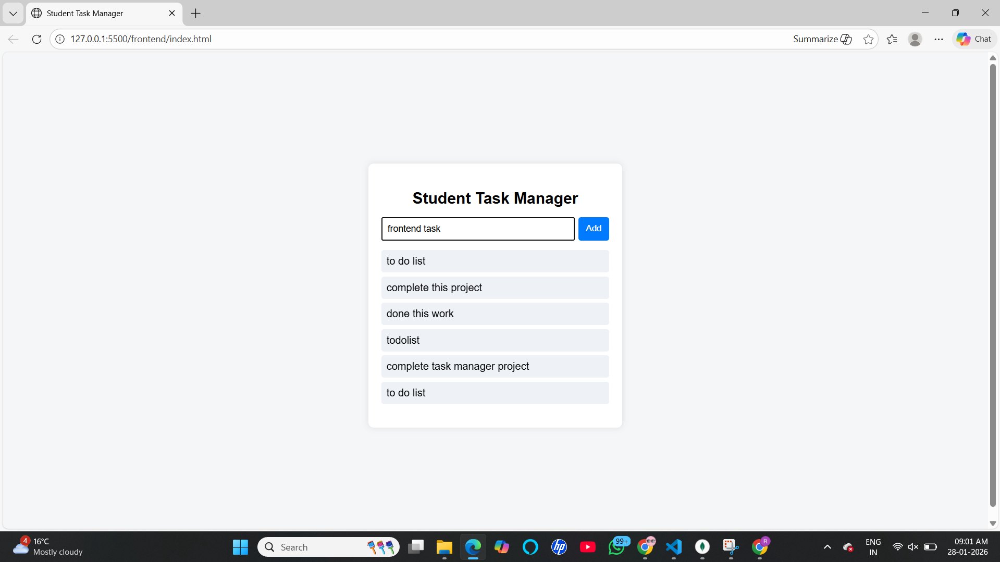
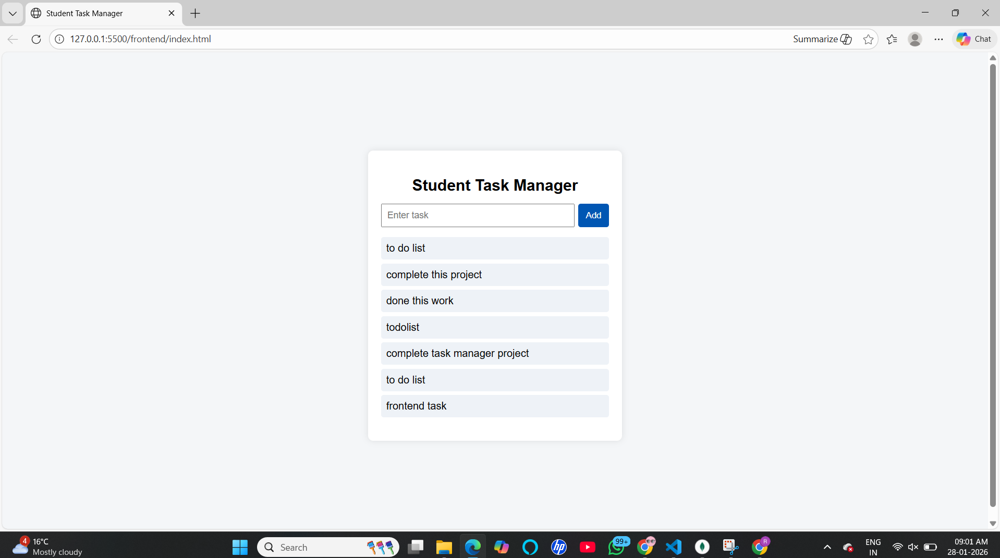
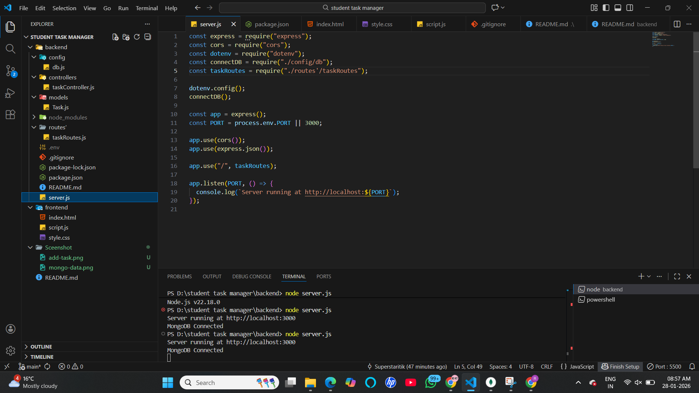
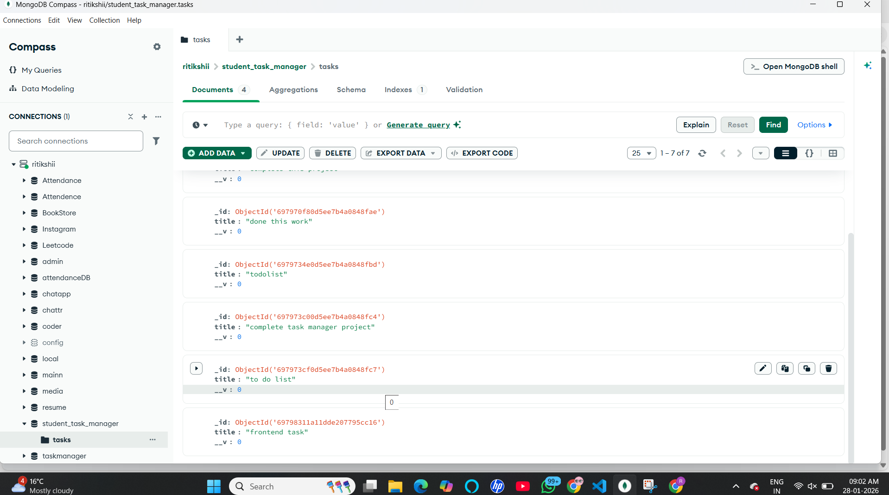

# Student Task Manager

This is a simple full-stack Student Task Manager project.

I am comfortable building projects using modern frameworks like React.
However, for this project I intentionally used **HTML, CSS, and JavaScript**
because the goal was to clearly demonstrate core concepts rather than
framework complexity.

Using plain HTML/CSS/JS helped me focus on:
- Understanding how frontend and backend communicate
- Implementing SPA behavior without page reload
- Writing clean and understandable code

React can make the UI more advanced and efficient, but for this project,
simplicity and clarity were more important.

## Project Overview

This project allows students to:
- Add tasks
- View tasks instantly
- Interact with the application without refreshing the page

The frontend communicates with a backend API, which stores data in MongoDB.

##  Technologies Used

### Frontend
- HTML  
- CSS  
- JavaScript (SPA behavior using Fetch API)

### Backend
- Node.js  
- Express.js  
- MongoDB  
- Mongoose  
- dotenv (.env for environment variables)

---

## Features

- Add new tasks
- Display all tasks
- No page reload (Single Page Application)
- Proper backend folder structure
- Secure environment variables using `.env`

---

## Screenshots

### Home Page

### Clicking on Add Button

### Code Structure

### MongoDB Data

---

## Project Demo Video

A complete working demo of this project is available here:  
 **Google Drive Video Link** :- https://drive.google.com/file/d/1cHQvFuhcOgF91_GkF8JkHR3-Su7GDkYp/view?usp=sharing

## Note

This project can easily be upgraded to React for a better UI and
state management, but the current implementation was chosen to
match the project requirements and keep it beginner-friendly.

